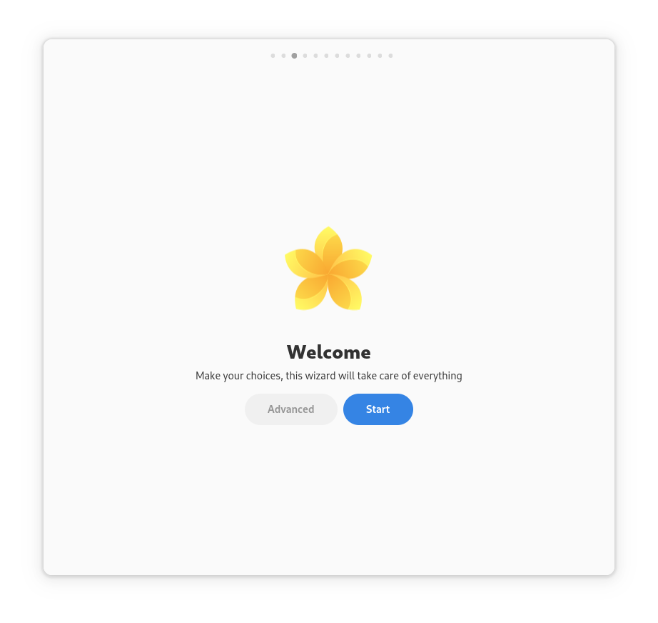

<div align="center">
    
    <h1>Vanilla OS First Setup</h1>
    <p>This utility is meant to be used in <a href="https://github.com/vanilla-os">Vanilla OS</a>
    as a first-setup wizard. Its purpose is to help the user to configure the
    system to their needs, e.g. by configuring hostname, theme, flatpak apps, etc.</p>
    <hr />
    <a href="https://hosted.weblate.org/projects/vanilla-os/first-setup/#information">

</a>
    <br />
    
</div>

## Run without building for Testing

> [!IMPORTANT]  
> You need to install all build and run dependencies first

```bash
python3 test.py -d
```

The "-d" option is the dry-run mode, without it, first-setup will make changes to your system.

Pass the "-c" flag to force the configure system mode.

### Test translations:

You can change the used language like this:
```bash
LANGUAGE=de python3 test.py -d
```

## Build

### Installing build dependencies
```bash
sudo apt-get update
sudo apt-get build-dep .
```

If you want to install the build dependencies manually, have a look in:
[debian/control](https://github.com/Vanilla-OS/first-setup/blob/main/debian/control)

### Building

> [!WARNING]  
> dpkg-buildpackage places it's output files (Like the .deb file) into the parent folder.

```bash
dpkg-buildpackage
```

or manually with meson:

```bash
meson setup build
meson compile -C build
```

Here you can change the install folder (default is /usr/local), for example:
```bash
meson setup --prefix="$(pwd)/install" build
```

## Install

### Installing runtime dependencies
These can be found here:
[debian/control](https://github.com/Vanilla-OS/first-setup/blob/main/debian/control)

> [!TIP]   
> If you use apt-get to install the .deb file it will automatically install the dependencies.

### Installing

```bash
sudo apt-get install ./vanilla-first-setup*.deb
```

or manually with meson:

```bash
meson install -C build
```

## Run

### Creating initial user

A special user is needed to run the initial setup for hostname, user-creation, locale, etc.

1. Create a user
2. Create the group vanilla-first-setup (Changing the gid is recommended to avoid messing with user groups)
3. Add the user to group vanilla-first-setup
4. Create the file `/var/lib/AccountsService/users/your_user`
```ini
[User]
Session=firstsetup
```
5. Create the file `/etc/gdm3/daemon.conf` (replace your_user)
```ini
[daemon]
AutomaticLogin=your_user
AutomaticLoginEnable=True
```

> [!WARNING]  
> All users in this group will be deleted on the first reboot after a successful first setup.

### Running
```bash
vanilla-first-setup
```

#### Flags:

- --dry-run (-d): Don't make any changes to the system.
- --force-configure-mode (-c): Force the configure system mode, independant of group.
- --force-regular-mode (-r): Force the regular mode, independant of group.
- --oem-mode (-o): Use the original equipment manufacturer mode with language, keyboard and timezone selection.

## Update translation file

To update the .pot file with newly added translation strings, run:

```bash
meson compile -C build vanilla-first-setup-pot
```
